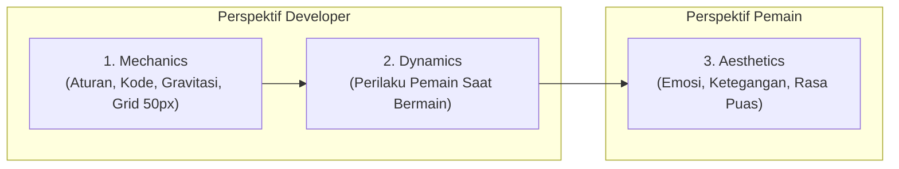
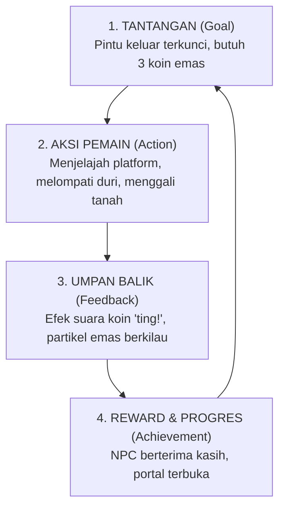
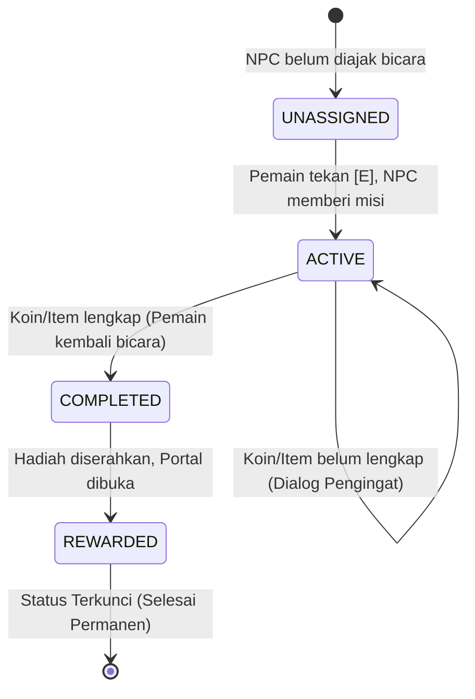
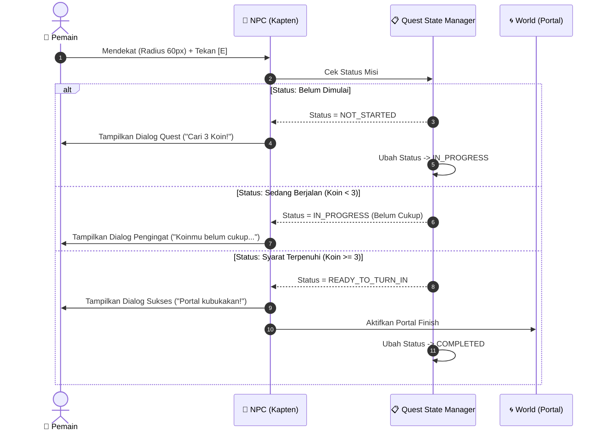

# 🎮 Konsep & Fundamental Pengembangan Game (Game Design & Architecture)

Dokumen ini dirancang sebagai panduan pembelajaran komprehensif mengenai **filosofi desain game (*Game Design Theory*)**, **psikologi interaksi pemain**, dan **arsitektur teknis perangkat lunak (*Software Architecture*)** yang digunakan oleh industri game profesional untuk membangun objektif, interaksi karakter (NPC), dan cerita (*story-driven gameplay*).

---

## 📑 Daftar Isi
1. [Esensi Game & Apa yang Membedakannya dari Media Lain](#1-esensi-game--player-agency)
2. [Pilar Teori Game Design (MDA Framework & Core Loop)](#2-pilar-teori-game-design)
3. [Psikologi di Balik Objektif & Interaksi Karakter (NPC)](#3-psikologi-objektif--interaksi-npc)
4. [Arsitektur Teknis: Cara Developer Membuat Game Tanpa AI](#4-arsitektur-teknis-game-development)
5. [Sistem Dialog & Narasi Berbasis Data (Data-Driven Narrative)](#5-sistem-dialog--narasi-berbasis-data)
6. [Visual Scripting & Node-Based Architecture](#6-visual-scripting--node-based-architecture)
7. [Studi Kasus: Membangun Story-Driven Quest di Engine Kita](#7-studi-kasus-implementasi-nyata)
8. [Glosarium Istilah Game Dev](#8-glosarium-istilah-game-dev)

---

## 🌟 1. Esensi Game & Player Agency

### A. Definisi Game Menurut Ahli
> *"Bermain game adalah upaya sukarela untuk mengatasi rintangan yang sebenarnya tidak perlu (*voluntary attempt to overcome unnecessary obstacles*)."*  
> — **Bernard Suits**, *The Grasshopper: Games, Life and Utopia*

> *"Game adalah serangkaian keputusan yang bermakna (*a series of interesting decisions*)."*  
> — **Sid Meier**, Kreator seri *Civilization*

### B. Player Agency: Pembeda Utama Film vs Game
* **Film & Buku (Pasif)**: Penonton hanya menyaksikan keputusan yang dibuat oleh tokoh utama. Jika Harry Potter membuka pintu, penonton tidak bisa memilih jalan lain.
* **Game (Aktif / Interaktif)**: Pemain memiliki **Agensi (*Player Agency*)**. Pemain yang menekan tombol, memilih kapan harus melompat, memutuskan apakah akan bicara pada NPC atau langsung menerobos jurang berbahaya. Keberhasilan atau kegagalan adalah akibat langsung dari tindakan pemain.

---

## 🔄 2. Pilar Teori Game Design

### A. MDA Framework (Mechanics, Dynamics, Aesthetics)
Framework standar industri yang dikembangkan oleh Robin Hunicke, Marc LeBlanc, dan Robert Zubek:



1. **Mechanics (Mekanika)**: Komponen dasar aturan game (lompat setinggi 120px, tanah berukuran 50×50px, koin bernilai 1 skor, tombol E untuk bicara).
2. **Dynamics (Dinamika)**: Pola permainan yang muncul saat pemain menjalankan mekanika tersebut (pemain belajar memperkirakan jarak lompat, menghindari duri, atau mencari rute aman).
3. **Aesthetics (Estetika Pengalaman)**: Respons emosional yang dirasakan pemain (rasa tegang saat melompati lahar, rasa penasaran dengan cerita NPC, kepuasan saat menyelesaikan misi).

---

### B. The Core Game Loop (Siklus Inti Permainan)
Setiap game yang adiktif dan menyenangkan memiliki siklus umpan balik (*Feedback Loop*):



Tanpa siklus ini, game kehilangan daya tariknya karena pemain tidak mendapatkan alasan mengapa mereka harus menggerakkan stik/keyboard.

---

### C. Flow Theory (Teori Aliran Keasyikan)
Diteliti oleh psikolog **Mihaly Csikszentmihalyi**: Pemain akan berada dalam kondisi fokus maksimal (*Flow State*) jika tingkat tantangan seimbang dengan tingkat keahlian (*skill*).

```
Tinggi ▲
       │       Zona Frustrasi (Terlalu Sulit)
TANTANGAN│      -------------------------------
       │      /       ZONA FLOW              /
       │     /   (Asyik & Ketagihan)       /
       │    /                             /
Rendah │   -------------------------------
       │       Zona Bosan (Terlalu Gampang)
       └─────────────────────────────────────►
       Rendah            KEAHLIAN             Tinggi
```

* **Terlalu Sulit**: Pemain putus asa (*rage quit*).
* **Terlalu Mudah**: Pemain mengantuk dan menutup game.
* **Tugas Designer**: Menuntun pemain secara bertahap melalui dialog NPC dan objektif yang perlahan semakin menantang.

---

## 🧠 3. Psikologi Objektif & Interaksi NPC

Mengapa desainer game menaruh NPC yang berbicara dan memberi tugas, bukan langsung menaruh garis finis saja?

### A. Teori Determinasi Diri (Self-Determination Theory)
Manusia termotivasi secara alami oleh tiga kebutuhan psikologis:
1. **Otonomi (*Autonomy*)**: Pemain merasa bebas memilih rute dan keputusan.
2. **Kompetensi (*Competence*)**: Pemain merasa pintar/jago saat berhasil memecahkan rintangan yang diminta NPC.
3. **Keterhubungan (*Relatedness*)**: Pemain merasa terhubung dengan dunia buatan melalui dialog emosional karakter NPC.

### B. Narrative Friction (Hambatan Naratif)
Jika sebuah game hanya *"Mulai di Titik A $\rightarrow$ Lari lurus $\rightarrow$ Selesai di Titik B"*, itu hanyalah tes reaksi jari (*reflex test*).  
Tetapi ketika ada **hambatan naratif**:
* Pintu portal ditutup rantai es.
* Seorang kakek tua penjaga mercusuar menangis karena kehilangan mutiaranya di gua bawah tanah.
* **Hasil**: Pemain terdorong mengeksplorasi gua bawah tanah bukan karena disuruh sistem, melainkan demi membantu kakek tua tersebut.

---

## 🛠️ 4. Arsitektur Teknis: Cara Developer Membuat Game Tanpa AI

Jauh sebelum kecerdasan buatan populer, industri game (sejak era *Super Mario 64*, *The Legend of Zelda*, *Pokemon Red/Blue*) telah memecahkan masalah ini dengan pola rekayasa perangkat lunak (*Design Patterns*).

### A. Finite State Machine (FSM / Mesin Status Quest)
FSM adalah arsitektur paling fundamental dalam sistem quest game:



#### Contoh Logika Kode Sederhana (JavaScript):
```javascript
class QuestManager {
    constructor() {
        this.state = 'UNASSIGNED'; // 'UNASSIGNED' | 'ACTIVE' | 'COMPLETED'
        this.requiredCoins = 3;
    }

    interactWithNPC(player) {
        if (this.state === 'UNASSIGNED') {
            this.state = 'ACTIVE';
            return "Halo petualang! Bisakah kamu carikan 3 koin emas untukku?";
        }
        
        if (this.state === 'ACTIVE') {
            if (player.coins >= this.requiredCoins) {
                this.state = 'COMPLETED';
                player.unlockPortal();
                return "Terima kasih banyak! Portal jalan keluar sudah kubuka.";
            } else {
                return `Kamu baru punya ${player.coins}/${this.requiredCoins} koin. Cari lagi ya!`;
            }
        }

        if (this.state === 'COMPLETED') {
            return "Semoga perjalananmu menyenangkan di babak selanjutnya!";
        }
    }
}
```

---

### B. Event-Driven Architecture (Observer Pattern)
Daripada NPC menjalankan perulangan (*loop*) 60 kali per detik untuk mengecek isi saku pemain, game menggunakan **arsitektur berbasis sinyal peristiwa**:

```
[ Pemain Menyentuh Koin ]
          │
          ▼
   Memancarkan Event: 'COIN_COLLECTED'
          │
   ┌──────┴───────────────────────────┐
   ▼                                  ▼
[ HUD Manager ]               [ Quest Manager ]
Perbarui teks angka skor      Cek target misi:
"Koin: 3 / 3"                 Jika cukup -> Trigger dialog selesai!
```

---

### C. Spatial Trigger Volumes (Area Pemicu Spasial)
Bagaimana game tahu pemain sedang berada dekat NPC?
* Di sekitar NPC (yang berukuran 50×50px), dibuat area sensor transparan (*Trigger Box / Circle Collider*) selebar 120px.
* Ketika kotak pemain bersentuhan (*overlap*) dengan sensor:
  1. Tampilkan tombol mengambang `[E] Bicara`.
  2. Aktifkan penangkap tombol keyboard (*input listener*).

---

## 📜 5. Sistem Dialog & Narasi Berbasis Data (Data-Driven Narrative)

Developer profesional **memisahkan kode engine dari naskah cerita**. Hal ini memungkinkan penulis naskah (*narrative designer*) mengarang cerita tanpa menyentuh kode pemrograman sama sekali.

### Contoh Format Deklaratif JSON:
```json
{
  "npc_chen": {
    "name": "Kapten Chen",
    "avatar": "🧙",
    "triggerRadius": 65,
    "quests": [
      {
        "id": "quest_dermaga_01",
        "objective": {
          "type": "COLLECT_ITEM",
          "targetId": "pearl_victoria",
          "amount": 1
        },
        "dialogues": {
          "start": [
            "Badai topan di Teluk Victoria sedang mengganas!",
            "Kapal feri kita tidak bisa berlayar tanpa Mutiara Pelindung.",
            "Tolong selami palung dermaga dan ambil mutiara itu untukku!"
          ],
          "in_progress": [
            "Waktu kita tidak banyak, anak muda!",
            "Mutiara itu masih ada di dasar laut teluk."
          ],
          "success": [
            "Luar biasa! Badai mulai mereda.",
            "Nyalakan mesin, portal ke pulau seberang telah kubuka!"
          ]
        },
        "onComplete": {
          "activatePortal": "portal_finish",
          "playFanfare": true
        }
      }
    ]
  }
}
```

---

## 🧩 6. Visual Scripting & Node-Based Architecture

Untuk developer non-koding atau level designer, industri game menciptakan **alat visual (*Visual Scripting*)**:
1. **RPG Maker (Event Sheets)**: Sistem kondisional berbasis baris (1990-an – sekarang).
2. **Unreal Engine (Blueprints)**: Menghubungkan logika permainan menggunakan kabel data dan kabel eksekusi.
3. **Yarn Spinner / Twine**: Standar penulisan narasi bercabang untuk game indie populer (*Night in the Woods*, *A Short Hike*).

### Arsitektur Node di Template Engine Kita:
Engine kita telah memiliki implementasi visual ini di [QuestLogicGraphView.js](file:///c:/Users/tryfi/OneDrive/foto-%20camera/Documents/andika/template_game2d/src/ui/QuestLogicGraphView.js):
* **Node Trigger**: Mendeteksi aksi bicara pemain (`npc_trigger`).
* **Node Kondisi**: Mengecek koin atau kepemilikan item (`condition_coins`).
* **Node Tindakan**: Menampilkan jendela percakapan bertahap (`dialogue`).
* **Node Reward**: Membuka gerbang portal finish kemenangan (`portal_activate`).

---

## 🎯 7. Studi Kasus: Implementasi Nyata di Template Game 2D Kita

Berikut resep penerapan praktis menghubungkan NPC dan Objektif di proyek game kita:



---

## 📖 8. Glosarium Istilah Game Dev

| Istilah | Penjelasan |
|---|---|
| **Player Agency** | Derajat kebebasan dan dampak nyata yang dimiliki pemain terhadap dunia game. |
| **Core Game Loop** | Rantai aksi berulang (Tantangan $\rightarrow$ Aksi $\rightarrow$ Hadiah) yang menjadi tulang punggung game. |
| **Pacing** | Pengaturan tempo ketegangan dan jeda santai agar pemain tidak jenuh atau kelelahan. |
| **FSM (Finite State Machine)** | Model matematika/komputasi yang memastikan sistem hanya berada di satu status pasti pada satu waktu. |
| **Trigger Volume** | Area tak kasat mata di kanvas/dunia game yang memicu peristiwa saat dilewati karakter. |
| **Data-Driven** | Pendekatan di mana konten cerita, stat, dan aturan dipisahkan ke dalam berkas data (JSON) tanpa mengubah kode engine. |
| **Ludonarrative Consistency** | Keselarasan antara cerita yang diceritakan naskah dengan apa yang benar-benar dimainkan oleh pemain. |

---

> [!TIP]
> **Rangkuman Filosofi Game**:  
> *"Game yang hebat bukan tentang grafis yang paling rumit atau baris kode terpanjang, melainkan tentang bagaimana desainer memberikan **alasan yang memuaskan** bagi pemain untuk terus melangkah maju."*
