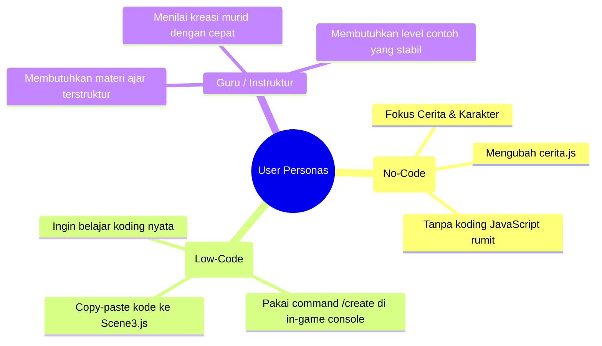
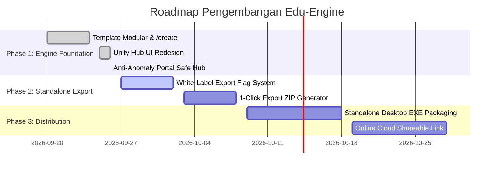

# 📄 Product Requirement Document (PRD)
## The Game Template 2D: Edu-Engine & Creator Suite

> **Versi Dokumen**: 1.0.0  
> **Status**: Approved & In Active Development  
> **Target Pengguna**: Murid Sekolah (SD/SMP/SMA), Guru/Instruktur Koding, Pemula Game Development  
> **Teknologi**: Phaser 4 (`v4.2.1`), Vite 5, Vanilla JavaScript, HTML5 Canvas  

---

## 🎯 1. Executive Summary & Vision

### 1.1 Latar Belakang
Belajar membuat game adalah salah satu metode paling efektif untuk mengenalkan logika pemrograman (*computational thinking*) kepada anak-anak. Namun, *game engine* profesional seperti Unity atau Unreal Engine memiliki kurva belajar yang sangat curam (*intimidating*), membutuhkan laptop berspesifikasi tinggi, dan proses instalasi software yang rumit. Di sisi lain, template game biasa seringkali membuat anak merasa hanya meminjam karya orang lain tanpa rasa kepemilikan (*sense of ownership*).

### 1.2 Visi Produk
Menjadikan **The Game Template 2D** sebagai **Mini Game Engine Edukasi (Edu-Engine) Berbasis Web**:
* **Ringan & Zero-Install**: Langsung berjalan di browser laptop sekolah, tablet, maupun HP Android dalam hitungan 2 detik.
* **Dual-Learning Path**: Mendukung jalur *No-Code* (data-driven via [cerita.js](file:///c:/Users/tryfi/OneDrive/foto-%20camera/Documents/andika/template_game2d/cerita.js)) dan jalur *Real-Code* (JavaScript via [Scene3.js](file:///c:/Users/tryfi/OneDrive/foto-%20camera/Documents/andika/template_game2d/src/scenes/Scene3.js)).
* **Sense of Ownership**: Menyediakan alur dari perancangan dunia menggunakan command ajaib (`/create`) hingga ekspor game mandiri (*Pure Game*) tanpa embel-embel template.

---

## 👥 2. User Personas

---

## 🏗️ 3. Arsitektur Dua Mode Utama (Core Product Architecture)

Produk beroperasi dalam dua mode independen:

### 3.1 Mode 1: Editor / Developer Mode (Saat Murid Bikin Game)
Digunakan saat murid membuka game di lingkungan pengembangan (Vite dev server):
* **Game Creator Hub** (Antarmuka peluncur bergaya Unity Hub).
* **Tutorial Story Campaign** (Scene 1 Lembah Salju ➔ Scene 2 Teluk Hong Kong).
* **Creative Sandbox World** (Scene 3 - Kanvas kreasi koding murid).
* **In-Game Developer Console** (Perintah `/create`, `/inspect`, `/speed`, `/tp`, dll).

### 3.2 Mode 2: Standalone Player / Exported Mode (Hasil Akhir Game)
Digunakan ketika game diekspor untuk dimainkan oleh pemain umum, teman, atau orang tua murid:
* **Pure Game**: 100% bebas dari tulisan *"The Game Template"* atau label latihan.
* **Custom Title Screen**: Menampilkan judul game buatan murid (`CONFIG_SKELETON.judulGame`) dan nama pembuat (`namaKelompok`).
* **Instant Action**: Tombol *Start Game* langsung membuka dunia buatan murid.
* **Dev Tools Hidden**: Console `/create` dan shortcut builder dinonaktifkan agar pemain biasa tidak merusak game.

---

## ⚙️ 4. Spesifikasi Fitur Fungsional (Functional Requirements)

### 4.1 Feature 1: Game Creator Hub (Unity Hub Style Launcher)
* **Status**: ✅ *Implemented*
* **Deskripsi**: Jendela peluncur utama bergaya Unity Hub yang dapat diakses dari menu utama melalui tombol `[🛠️ My Projects]`.
* **Kebutuhan Rinci**:
  1. **Sidebar Navigasi**: Tab *Projects*, *Templates*, *Tutorials*, dan *Console Commands*.
  2. **Projects Tab**: Menampilkan tabel bersih yang hanya berisi dunia aktif murid (*🌟 Sandbox World - Scene 3*).
  3. **Filter Pencarian**: Kolom pencarian instan (*instant search filter*) untuk menyaring nama project.
  4. **Starter Templates**: Menampilkan kartu template (*Blank Platformer*, *Parallax & Weather*, *Data-Driven RPG*).
  5. **Tutorials Tab**: Menampilkan Level 1 dan Level 2 sebagai studi kasus terpisah tanpa mengotori tab Projects.
  6. **Tombol `+ New World`**: Membuka panduan wizard pembuatan level baru.

### 4.2 Feature 2: In-Game Builder Console (`/create`)
* **Status**: ✅ *Implemented*
* **Deskripsi**: Sistem generator kode template modular yang dapat dipanggil saat bermain melalui chat bar atau tombol shortcut `+/create`.
* **Katalog 10 Template Kode**:
  1. `/create scene` — Kerangka 1 file class Scene Phaser lengkap.
  2. `/create tile floor` — Platform lantai dasar dan pijakan melayang.
  3. `/create sprite player` — Karakter hero, fisika, collider, dan kamera follow.
  4. `/create npc` — Sprite NPC interaktif dengan animasi napas idle dan prompt `[E]`.
  5. `/create dialogue` — Sistem percakapan multi-NPC (percakapan NPC A terpisah dari NPC B).
  6. `/create quest` — Pelacak misi aktif di HUD dan target item quest.
  7. `/create obstacle` — Rintangan duri tajam dengan efek darah berkurang (`takeDamage`) dan kedip invincibility.
  8. `/create parallax` — Latar belakang 3 layer kedalaman (`0x`, `0.2x`, `0.5x`).
  9. `/create cutscene` — Kamera sinematik otomatis dan penguncian kontrol pemain sementara.
  10. `/create portal` — Pintu gerbang keluar aman kembali ke Menu Hub.
* **Format Output**: Kartu kode interaktif dengan panduan penempatan (*target file & function*) dan tombol **`[📋 Salin Kode]`** 1-klik (berubah menjadi `✓ Tersalin!`).

### 4.3 Feature 3: Live Code Inspector (`/inspect`)
* **Status**: ✅ *Implemented*
* **Deskripsi**: Overlay HUD interaktif untuk memvisualisasikan konsep variabel matematika/fisika:
  * Slider Kecepatan Jalan (`100 - 600 px/s`).
  * Slider Daya Lompat (`200 - 800 px/s`).
  * Slider Gravitasi Dunia (`100 - 1400 px/s²`).
  * Real-time Code Highlighting: Baris kode JavaScript menyala ketika karakter jalan, lompat, terkena duri, atau bicara dengan NPC.

### 4.4 Feature 4: Anti-Anomaly Portal Architecture
* **Status**: ✅ *Implemented*
* **Deskripsi**: Mekanisme pencegahan game crash, loop tak hingga, atau layar hitam saat transisi antar-level:
  * Tutorial Mode (Scene 1 ➔ Scene 2) terisolasi penuh dan berakhir di modal kemenangan feri.
  * Portal di Sandbox World (Scene 3) mengarah kembali ke **Menu Utama / Project Hub**, menjamin tidak ada loop atau error scene tidak ditemukan.

### 4.5 Feature 5: Standalone Game Export Pipeline (Planned)
* **Status**: ⏳ *Roadmap Q4*
* **Deskripsi**: Kemampuan membundel game menjadi file standalone siap distribusi:
  * **Opsi A (Web Standalone .ZIP)**: 1-klik unduh bundel zip berisi `index.html` dan assets tanpa kode developer/editor.
  * **Opsi B (Desktop .EXE)**: Wrapper Electron/NW.js untuk Windows PC.
  * **Opsi C (Shareable Web Link)**: Integrasi deploy 1-klik ke hosting statis gratis.

### 4.6 Feature 6: Top Engine Menu Bar & In-Game Scripting Workspace (Blender Style)
* **Status**: 🚀 *In Active Development*
* **Deskripsi**: Bilah menu atas (*Top Menu Bar*) dan panel editor kode terintegrasi (*In-Game Scripting Workspace*) langsung di dalam browser tanpa ketergantungan software eksternal (VS Code):
  1. **Top Menu Bar (Header Slim 36px)**:
     * Menu `File ▾`: Buka Project Hub, Simpan Progres, Ekspor Game.
     * Menu `World ▾`: Buka Sandbox, Pasang Tile, Pasang NPC, Ubah Tema Langit.
     * Tombol Pintas: `[📜 Scripting]`, `[🎛️ Inspect]`, `[+/create]`, `[▶ Run/Apply]`.
  2. **In-Game Scripting Workspace (Panel Koding Terintegrasi)**:
     * Panel editor kode monospaced dengan nomor baris (dark slate theme ala Blender 5.2 Scripting Workspace).
     * Tab Editor: `cerita.js (Data Config)` dan `Scene3.js (Active Script)`.
     * Tombol **`[📋 Sisipkan Template /create]`** untuk memasukkan cuplikan kode langsung ke baris kursor.
     * Tombol **`[▶ Terapkan / Run Script]`** untuk menerapkan perubahan kode secara live.
     * Dapat diminimalkan atau disembunyikan kapan saja agar murid bisa menguji gameplay.

---

## 🔒 5. Kebutuhan Non-Fungsional (Non-Functional Requirements)

1. **Performa**:
   * Menjaga stabilitas **60 FPS** di laptop standar sekolah (Intel Core i3 / RAM 4GB).
   * Waktu muat awal (*initial load*) di bawah **2 detik**.
2. **Kompatibilitas Layar & Input**:
   * Responsif di resolusi laptop (1366x768, 1920x1080) dan tablet/smartphone (16:9 & ultrawide).
   * Dual-input: Keyboard/Mouse PC (W/A/S/D/Space/E) dan Layar Sentuh (*multi-touch on-screen D-Pad*).
3. **Keandalan & Pemulihan (Version Control)**:
   * Proyek terintegrasi penuh dengan Git dan remote repository GitHub untuk memastikan kode dapat di-recover setiap saat.

---

## 📅 6. Release Roadmap & Milestones

---

## 📊 7. Success Metrics (KPI)

1. **Efisiensi Waktu Pembuatan Game**: Murid dapat membuat scene baru lengkap dengan NPC dan rintangan dalam waktu **< 5 menit**.
2. **Zero Portal Crash**: 0 laporan crash layar hitam atau infinite teleport loop saat navigasi level.
3. **Student Pride Index**: 100% game hasil ekspor memiliki nama game dan pembuat kustom tanpa watermark/branding template.
