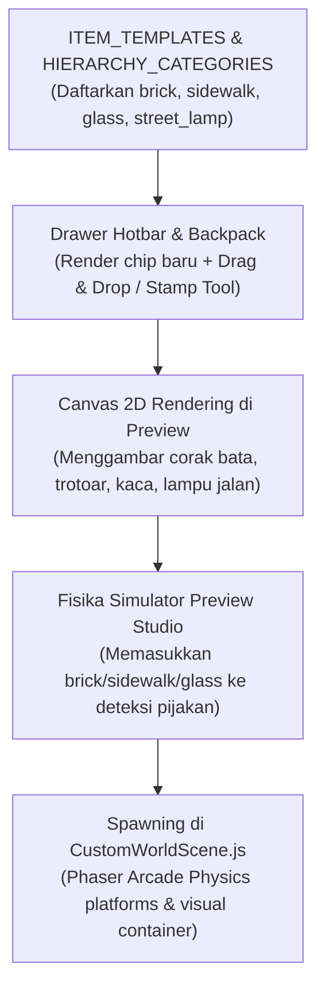

# 🏛️ Spesifikasi & Rencana Objek Bangunan & Perkotaan (Preview Studio)

Dokumen ini merangkum analisis teknis, spesifikasi ukuran petak (Grid Matrix 50×50px), aturan visual rendering, dan rencana integrasi untuk objek bangunan (Batu Bata, Trotoar, Lampu Jalan, Kaca, dll.) ke dalam **Preview Studio** ([SceneBuilderModal.js](file:///c:/Users/tryfi/OneDrive/foto-%20camera/Documents/andika/template_game2d/src/ui/SceneBuilderModal.js)) dan gameplay engine ([CustomWorldScene.js](file:///c:/Users/tryfi/OneDrive/foto-%20camera/Documents/andika/template_game2d/src/scenes/CustomWorldScene.js)).

---

## 🎯 1. Tujuan & Manfaat Fitur

Sebelumnya, Preview Studio berfokus pada elemen alamiah (Tanah/Dirt, Pijakan Melayang/Platforms, Air/Lava, Duri, Monster, NPC, Koin, dan Portal). 

Dengan penambahan **Paket Objek Bangunan & Perkotaan (Urban Architecture Pack)**:
1. Kreator dapat membangun **rumah, gedung perkantoran, pertokoan, jembatan trotoar, halte, lampu kota, hingga interior ruangan**.
2. Dunia game menjadi jauh lebih variatif (bisa bertema kota modern, kastil bata klasik, desa berpaving, atau laboratorium bertembok kaca).
3. Semua objek memiliki **aturan grid presisi 50×50px**, sehingga tidak ada objek yang meleset, tumpang tindih, atau bercelah.

---

## 📐 2. Standar Ukuran & Presisi Grid (Zero-Drift 50×50px)

Setiap objek mematuhi sistem kisi-kisi standar game 2D kita:
- **1 Unit Petak Standar = 50px × 50px**.
- Penempatan menggunakan koordinat kolom integer `col` dan baris `row`.
- Posisi pusat pixel dihitung dengan rumus:
  $$\text{pixelX} = \text{col} \times 50 + 25$$
  $$\text{pixelY} = \text{row} \times 50 + 25$$

---

## 🧱 3. Daftar Spesifikasi Objek Baru

Berikut daftar objek bangunan yang dirancang untuk ditambahkan ke palet studio:

| No | Nama Objek | ID Tipe (`type`) | Ukuran Grid | Sifat Fisika | Layer Depth | Deskripsi Visual & Perilaku |
|---|---|---|---|---|---|---|
| **1** | **🧱 Dinding Batu Bata** | `brick` | **1 × 1 petak** (50×50px) | Solid Penuh (Lantai/Tembok) | 5 | Balok bata merah terakota klasik dengan pola susun silang (*staggered bricks*) dan garis semen abu-abu bersih. Menempel rapat tanpa celah saat berjejer. |
| **2** | **🚶 Trotoar / Sidewalk** | `sidewalk` | **1 × 1 petak** (50×50px) | Solid Pijakan (Platform) | 6 | Paving beton abu-abu muda bertekstur petak halus dengan garis pembatas trotoar (*curbstone*) di sisi bawah. Cocok untuk jalanan kota. |
| **3** | **🪟 Blok Kaca Modern** | `glass` | **1 × 1 petak** (50×50px) | Solid Tembus Pandang | 5 | Kaca arsitektur transparan (cyan muda ber-alpha 0.65) dengan lis frame tipis dan garis kilauan cahaya diagonal (*diagonal specular glint*). Karakter tidak tembus. |
| **4** | **🏮 Lampu Jalan Klasik** | `street_lamp` | **1 × 2 petak** (50×100px) | Pass-Through (Tembus) | 7 | Tiang lampu besi hitam setinggi 2 petak dengan lentera kap kaca di atas. Memiliki efek pendar cahaya (*ambient yellow-orange radial glow*) yang hidup di waktu malam/sore. |
| **5** | **🪜 Tangga Panjat** | `ladder` | **1 × 1 petak** (50×50px) | Utilitas (Panjat / Pass) | 6 | Tangga kayu/besi vertikal dengan anak tangga rapi. Memudahkan pemain memanjat ke atas atap gedung atau lantai dua. |
| **6** | **🏠 Atap Bangunan** | `roof` | **1 × 1 petak** (50×50px) | Solid Pijakan | 6 | Balok genteng miring warna merah bata / biru arsitektur untuk mahkota atap rumah/toko. |
| **7** | **🚧 Pagar Pembatas** | `fence` | **1 × 1 petak** (50×50px) | Solid Rendah / Dekor | 6 | Pagar teralis besi hitam / palang kayu pengaman untuk teras rumah, balkon gedung, atau tepi jembatan. |

---

## 🎨 4. Detail Rendering Visual (Canvas Preview & Phaser Game)

### A. 🧱 Batu Bata (`brick`)
- **Warna Dasar**: `#991b1b` / `#b91c1c` (Merah Bata Terakota).
- **Garis Semen (Mortar)**: `#cbd5e1` (Ketebalan 1.2px).
- **Pola Tekstur**: 3 baris bata per petak 50px, berselang-seling (pola *running bond* 1/2 panjang bata) sehingga saat disusun ke atas atau ke samping membentuk dinding kokoh alami.

### B. 🚶 Trotoar (`sidewalk`)
- **Warna Paving**: `#64748b` (Beton Abu-Abu Menengah).
- **Permukaan Pijakan**: Garis abu-abu terang `#94a3b8` (tebal 3px) di bagian atas petak.
- **Batas Trotoar (Curb)**: Garis gelap `#334155` di bagian dasar petak untuk membedakan trotoar dari jalan aspal di bawahnya.
- **Garis Paving**: Garis pembagi paving vertikal di tengah petak (x + 25px) dengan opasitas halus.

### C. 🪟 Kaca Modern (`glass`)
- **Warna Kaca**: `rgba(56, 189, 248, 0.28)` (Cyan Transparan).
- **Kusen / Bingkai**: `#0284c7` / `#38bdf8` (Border 1.5px presisi).
- **Kilauan Pantulan (Specular Glint)**: Dua garis diagonal putih `rgba(255, 255, 255, 0.65)` yang melintasi sudut kiri atas ke kanan bawah petak.

### D. 🏮 Lampu Jalan (`street_lamp`)
- **Tiang Vertikal**: Besi gelap `#1e293b` selebar 6px yang memanjang dari petak bawah ke petak atas.
- **Kaki Penopang**: Kotak dudukan cor besi selebar 18px di dasar petak bawah.
- **Kepala Lentera**: Kotak lentera klasik beratap trapesium `#0f172a` dengan kaca kuning cerah `#fef08a`.
- **Efek Glow**: Lingkaran gradasi radial kuning-keemasan (`rgba(251, 191, 36, 0.35)` meluruh ke `transparent`) dengan radius 40px di sekitar lentera.

---

## 🛠️ 5. Rencana Titik Modifikasi Kode



### 1. `src/ui/SceneBuilderModal.js`
- **Katalog `ITEM_TEMPLATES`**:
  - Menambahkan entri untuk `brick`, `sidewalk`, `glass`, `street_lamp`, `ladder`, `roof`, `fence`.
- **Kategori `HIERARCHY_CATEGORIES`**:
  - Menambahkan kategori folder baru:
    ```javascript
    {
        id: 'buildings',
        label: 'Struktur & Bangunan',
        icon: '🏢',
        types: ['brick', 'sidewalk', 'glass', 'street_lamp', 'ladder', 'roof', 'fence'],
        color: '#f97316'
    }
    ```
- **Fungsi Gambar Canvas (`drawEntity`)**:
  - Menambahkan blok render grafis khusus untuk masing-masing tipe objek baru pada kanvas 60fps preview.
- **Deteksi Lantai Pijakan (`floorCandidates`)**:
  - Mendaftarkan `['platforms', 'dirt', 'chest', 'brick', 'sidewalk', 'glass', 'roof']` agar karakter simulasi otomatis bisa berdiri di atas balok bata/trotoar/kaca/atap.

### 2. `src/scenes/CustomWorldScene.js`
- **Spawning di Phaser Engine**:
  - Mengelompokkan entitas bertipe `brick`, `sidewalk`, `glass`, `roof` ke dalam grup `this.platforms` dengan collider fisik Arcade Physics aktif.
  - Untuk `glass`: Mengatur transparansi `alpha = 0.65` dan kilauan specular.
  - Untuk `street_lamp`: Membuat container tiang lampu dengan kedalaman depth `setDepth(7)` dan aura cahaya lembut.

---

## ✅ 6. Checklist Pelaksanaan

- [x] Daftarkan definisi objek baru di `ITEM_TEMPLATES` dan kategori `buildings` di `HIERARCHY_CATEGORIES`.
- [x] Buat renderer 2D Canvas di [SceneBuilderModal.js](file:///c:/Users/tryfi/OneDrive/foto-%20camera/Documents/andika/template_game2d/src/ui/SceneBuilderModal.js) untuk `brick`, `sidewalk`, `glass`, `street_lamp`, dan pelengkapnya (`ladder`, `roof`, `fence`).
- [x] Uji Stamp Tool & Drag-and-Drop dari Hotbar Drawer studio agar objek dapat ditaruh presisi di petak grid 50px.
- [x] Implementasikan spawning di [CustomWorldScene.js](file:///c:/Users/tryfi/OneDrive/foto-%20camera/Documents/andika/template_game2d/src/scenes/CustomWorldScene.js) agar pemain bisa berjalan dan menabrak balok bangunan saat game dijalankan.
- [x] Validasi build sintaks (`npm run build`) tanpa error (berhasil build 53 modul).
