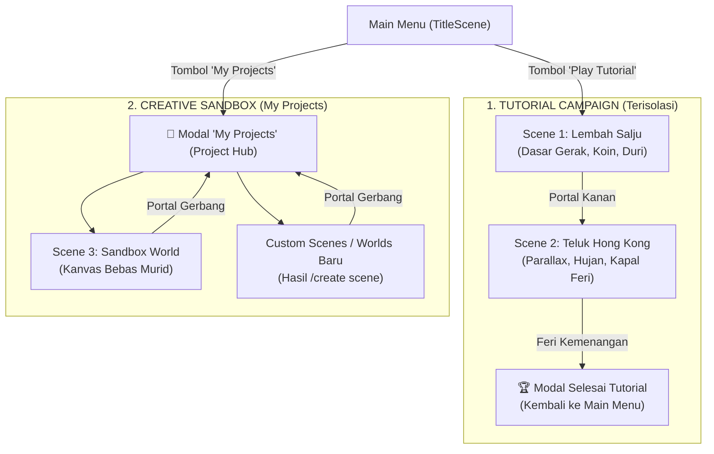

# 🗺️ Implementation Plan: World & Scene Builder Otomatis (`/create`) & Project Hub

> **Proyek**: The Game Template 2D (Phaser 4 Edition)  
> **Konsep Arsitektur**: *Developer & Project Hub Pattern* (ala Unity Hub, VS Code, dan Blender)  
> **Target Pengguna**: Murid sekolah / pemula koding edukasi game 2D  
> **Tujuan**: Memisahkan Tutorial resmi dengan Sandbox kreasi murid agar **100% bebas dari anomali portal**, serta menyediakan generator template kode siap pakai via `/create`.

---

## 📌 1. Analisis Arsitektur: Pemisahan Tutorial & Project Hub

### 1.1 Masalah Anomali Portal pada Arsitektur Lama
Pada rancangan awal, jika portal Scene 2 langsung menyambung ke Scene 3 (dan Scene 3 menyambung ke scene baru buatan anak), timbul resiko:
* **Crash / Layar Hitam**: Anak membuat scene baru tapi belum terdaftar di `main.js`.
* **Portal Nyasar / Dead-End**: Murid mengubah scene tanpa memperbarui koordinat target.
* **Infinite Teleport Loop**: Posisi spawn pemain menempel pada bibir portal kembali.

### 1.2 Solusi Baru: *Developer Hub Pattern* (Unity / VS Code Style)
Kita memisahkan alur game menjadi **dua mode independen**:



#### Manfaat Pendekatan Ini:
1. **Scene 1 & Scene 2 Murni Tutorial**: Cerita runtut, tidak tercampur dengan kodingan eksperimen murid. Begitu Feri selesai, murid mendapat pesan: *"Selamat! Kamu telah menguasai dasar game. Sekarang buka 'My Projects' untuk membuat duniamu sendiri!"*.
2. **Anomali Portal Lenyap**: Portal di dunia kreasi murid memiliki 1 tujuan pasti: **"Kembali ke Project Hub (Main Menu)"**. Tidak ada risiko tersesat atau bentrok antar-scene.
3. **Mental Model Developer Sejak Dini**: Anak-anak memahami konsep *"Sample Project"* vs *"My Workspace"*, persis seperti di software profesional (Unity Hub, Scratch, Roblox Studio, VS Code).

---

## 🎨 2. Desain Antarmuka: Main Menu & Project Hub Modal

### 2.1 Perubahan Menu di `TitleScene.js`
Menu vertikal di sisi kanan logo diperbarui menjadi:
* **`[ 🎮 PLAY TUTORIAL ]`** (Tombol Primer - Menjalankan Scene 1 ➔ Scene 2)
* **`[ 🛠️ MY PROJECTS ]`** (Tombol Sekunder Aksen Biru - Membuka Project Hub Modal)
* **`[ ⚙️ SETTINGS ]`** (Pengaturan Audio, Volume, & Kontrol)
* **`[ ✕ QUIT ]`** (Konfirmasi keluar game)

### 2.2 Tampilan Modal `My Projects` (Project Hub)
Komponen baru `src/ui/ProjectHubModal.js` yang menampilkan:
* **Daftar Dunia / Project**:
  * 🌟 **Sandbox World (Scene 3)** — *Dunia default berlantai, siap diedit & ditempel kode `/create`*.
  * ➕ **Dunia Kustom** — *Otomatis muncul jika murid membuat scene baru*.
* **Status Badge**: Menampilkan jumlah objek / elemen di scene tersebut.
* **Panduan Bantuan Developer Cilik**: *Petunjuk cara menggunakan `/create` di dalam game*.

---

## 🛠️ 3. Katalog Perintah `/create` di Command Console

Fitur `/create` dapat dijalankan dengan mengetik di chat bar atau mengklik tombol **`+/create`** di header konsol.

| Perintah | Fungsi & Hasil Template Kode | Target Tempel (Paste) |
| :--- | :--- | :--- |
| **`/create`** | Menampilkan daftar seluruh elemen yang bisa dibuat | Chat Console |
| **`/create scene [nama]`** | Menghasilkan kerangka 1 file Class Scene utuh + petunjuk 2 baris registrasi di `main.js` dan Project Hub | `src/scenes/[Nama]Scene.js` |
| **`/create tile floor`** | Pijakan lantai tanah & platform melayang dengan physics static group | `create()` di `Scene3.js` |
| **`/create sprite player`** | Inisialisasi hero, collider lantai, bounce, dan kamera follow | `create()` di `Scene3.js` |
| **`/create npc [nama]`** | Karakter NPC interaktif, animasi napas/idle, dan prompt `[E]` di atas kepala | `create()` di `Scene3.js` |
| **`/create dialogue [nama]`** | Sistem percakapan multi-NPC (dialog NPC A terpisah dari NPC B) | `handleInteract()` di `Scene3.js` |
| **`/create quest [judul]`** | Pelacak misi aktif di HUD + notifikasi perayaan saat syarat terpenuhi | `create()` di `Scene3.js` |
| **`/create obstacle`** | Duri berbahaya / perangkap + overlap darah berkurang & efek kedip | `create()` di `Scene3.js` |
| **`/create parallax`** | Background 3 lapis kedalaman (langit `0x`, bukit jauh `0.2x`, pohon `0.5x`) | `create()` di `Scene3.js` |
| **`/create cutscene`** | Sinematik kamera (kamera bergeser otomatis, kunci tombol gerak, dialog cerita) | Method di `Scene3.js` |
| **`/create portal`** | Portal gerbang aman menuju kembali ke Project Hub (Main Menu) | `create()` di `Scene3.js` |

---

## 🏗️ 4. Desain Komponen Teknis

### 4.1 Modul Generator Template: `src/utils/SceneTemplates.js`
Menyimpan seluruh template kode JavaScript dengan format bersih, komentar Bahasa Indonesia yang ramah pemula, dan fungsi generator:
* `getTemplate(type, args)`: Mengambil kode template sesuai jenis.
* `getAvailableCommands()`: Daftar opsi yang muncul saat mengetik `/create`.

### 4.2 Komponen UI Project Hub: `src/ui/ProjectHubModal.js`
Modal responsif berbasis DOM/HTML yang konsisten dengan estetika dark mode template game:
* Menampilkan daftar project aktif (Scene 3, dll).
* Tombol *Play / Masuk Dunia*.
* Integrasi transisi langsung ke scene yang dipilih.

### 4.3 Peningkatan `src/utils/CommandConsole.js`
* Menambahkan tombol **`+/create`** di barisan tombol header (berdampingan dengan `/inspect` dan `/learn`).
* Menampilkan **Kartu Kode Snippet (Code Card)** dengan tombol **`[📋 Salin Kode]`** 1-klik yang memberikan feedback visual *"✓ Tersalin!"*.

### 4.4 Penataan Kanvas `src/scenes/Scene3.js`
Menyediakan komentar penanda (*code anchors*) yang memudahkan anak menaruh hasil salinan kodenya tanpa tersesat:
```javascript
// ===============================================================
// 🎨 AREA KREASI KODING MURID (TEMPEL KODE /create DI SINI)
// ===============================================================
// [1] Tempel Background & Parallax di sini:

// [2] Tempel Lantai & Platform di sini:

// [3] Tempel NPC & Dialog di sini:

// [4] Tempel Rintangan & Duri di sini:
// ===============================================================
```

---

## 🚀 5. Tahapan Eksekusi Pengerjaan (Execution Roadmap)

```mermaid
gantt
    title Tahapan Implementasi World Builder & Project Hub
    dateFormat  X
    axisFormat %s
    section Tahap 1: Hub & Menu
    Perbarui Menu TitleScene.js               :0, 1
    Buat Komponen ProjectHubModal.js          :1, 2
    section Tahap 2: Template Engine
    Buat Modul SceneTemplates.js              :2, 3
    section Tahap 3: Command & UI Console
    Registrasi /create di CommandConsole.js   :3, 4
    Tambah Tombol +/create & Copy Card UI     :4, 5
    section Tahap 4: Integrasi Scene 3 & Tes
    Rapikan Scene3.js dengan Anchor Komentar   :5, 6
    Uji Coba Alur Tutorial & Sandbox di Browser:6, 7
```



### Checklist Implementasi:
- [ ] **Langkah 1**: Perbarui [TitleScene.js](file:///c:/Users/tryfi/OneDrive/foto-%20camera/Documents/andika/template_game2d/src/scenes/TitleScene.js) untuk membagi menu menjadi *Play Tutorial* dan *My Projects*.
- [ ] **Langkah 2**: Buat komponen `src/ui/ProjectHubModal.js` sebagai pusat peluncuran dunia kreasi murid.
- [ ] **Langkah 3**: Buat `src/utils/SceneTemplates.js` berisi katalog lengkap template kode (`scene`, `tile`, `player`, `npc`, `dialogue`, `quest`, `obstacle`, `parallax`, `cutscene`, `portal`).
- [ ] **Langkah 4**: Tambahkan handler `/create` dan tombol shortcut `+/create` di [CommandConsole.js](file:///c:/Users/tryfi/OneDrive/foto-%20camera/Documents/andika/template_game2d/src/utils/CommandConsole.js).
- [ ] **Langkah 5**: Berikan komentar panduan yang bersih di [Scene3.js](file:///c:/Users/tryfi/OneDrive/foto-%20camera/Documents/andika/template_game2d/src/scenes/Scene3.js) dan pastikan portal kembali aman menuju Main Menu.
- [ ] **Langkah 6**: Jalankan browser lokal dan uji coba alur navigasi dari menu, tutorial, sandbox, hingga salin-tempel kode `/create`.
